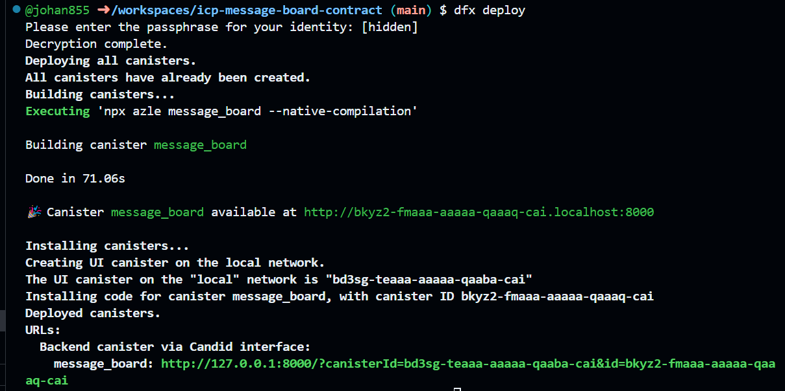

##### MeowMeow Application for ICP


Visit us at: https://meowmeowcats.app/

Follow us on: https://www.instagram.com/meowmeow_catsapp/

## Getting started

**NOTE**: After `dfx deploy`, when developing in GitHub Codespaces, run `./canister_urls.py` and click the links that are shown there.

## Steps to run

1. Install `nvm`:
- `curl -o- https://raw.githubusercontent.com/nvm-sh/nvm/v0.39.3/install.sh | bash`

2. Switch to node v20:
- `nvm install 20`
- `nvm use 20`

3. Install build dependencies:
## In codespaces (This build comes with a Debian image - See .devcontainer)
```
sudo apt-get install podman
```

4. Install `dfx`
- `DFX_VERSION=0.16.1 sh -ci "$(curl -fsSL https://sdk.dfinity.org/install.sh)"`

5. Add `dfx` to PATH:
- `echo 'export PATH="$PATH:$HOME/bin"' >> "$HOME/.bashrc"`

6. Run a local replica
- `dfx start --host 127.0.0.1:8000`

#### IMPORTANT NOTE 
If you make any changes to the `StableBTreeMap` structure like change datatypes for keys or values, changing size of the key or value, you need to restart `dfx` with the `--clean` flag. `StableBTreeMap` is immutable and any changes to it's configuration after it's been initialized are not supported.
- `dfx start --host 127.0.0.1:8000 --clean`

7. Deploy a canister
- `dfx deploy`

You should see the following result:



Also, if you are building an HTTP-based canister and would like your canister to autoreload on file changes (DO NOT deploy to mainnet with autoreload enabled):
```
AZLE_AUTORELOAD=true dfx deploy
```

8. Stop a local replica
- `dfx stop`

#### When canister is ready and deployed, you can interact with the message_board through the following curl requests (As a REST API).

### create a message:
- `curl -X POST <CANISTER_URL>/<REQUEST_PATH> -H "Content-type: application/json" -d <PAYLOAD>`
Example: 
- `curl -X POST http://bkyz2-fmaaa-aaaaa-qaaaq-cai.localhost:8000/messages -H "Content-type: application/json" -d '{"title": "MeowMeow", "body": "My cat is the most important being to meOW...", "attachmentURL": "https://meowmeowcats.app/assets/images/image05.png?v=f0f7605d"}'`
Response:
```
{
    "id": "d8326ec8-fe70-402e-8914-ca83f0f1055b",
    "createdAt": "2024-03-30T15:20:10.441Z",
    "title": "MeowMeow",
    "body": "My cat is the most important being to meOW...",
    "attachmentURL": "https://meowmeowcats.app/assets/images/image05.png?v=f0f7605d"
}
```

### update a message:
- `curl -X PUT <CANISTER_URL>/<REQUEST_PATH>/<MESSAGE_ID> -H "Content-type: application/json" -d <PAYLOAD>`
Example (In this case we include a message id in the payload to identify the message we want to update): 
- `curl -X PUT  http://bkyz2-fmaaa-aaaaa-qaaaq-cai.localhost:8000/messages/d8326ec8-fe70-402e-8914-ca83f0f1055b -H "Content-type: application/json" -d '{"title": "UPDATED TITLE", "body": "some important MEOW things", "attachmentURL": "https://meowmeowcats.app/assets/images/image01.svg?v=f0f7605d"}'`
Response:
```
{
    "id": "d8326ec8-fe70-402e-8914-ca83f0f1055b",
    "createdAt": "2024-03-29T11:23:11.441Z",
    "title": "UPDATED TITLE",
    "body": "some important MEOW things",
    "attachmentURL": "https://meowmeowcats.app/assets/images/image01.svg?v=f0f7605d",
    "updatedAt": "2024-03-30T15:20:10.441Z"
}
```

### get all messages:
- `curl <CANISTER_URL>/<REQUEST_PATH>`
Example:
- `curl http://bkyz2-fmaaa-aaaaa-qaaaq-cai.localhost:8000/messages`
Response:
```
[
    {
        "id": "d8326ec8-fe70-402e-8914-ca83f0f1055b",
        "createdAt": "2024-02-09T11:24:32.441Z",
        "title": "UPDATED TITLE",
        "body": "some important Meow things",
        "attachmentURL": "https://meowmeowcats.app/assets/images/image01.svg?v=f0f7605d",
        "updatedAt": "2024-03-30T15:20:10.441Z"
    }
]
```

### get a message:
- `curl <CANISTER_URL>/<REQUEST_PATH>/<MESSAGE_ID>`
Example (here we only provide a message id):
- `curl http://bkyz2-fmaaa-aaaaa-qaaaq-cai.localhost:8000/messages/d8326ec8-fe70-402e-8914-ca83f0f1055b`
Response:
```
{
    "id": "d8326ec8-fe70-402e-8914-ca83f0f1055b",
    "createdAt": "2024-02-09T11:24:32.441Z",
    "title": "UPDATED TITLE",
    "body": "some important MEOW things",
    "attachmentURL": "https://meowmeowcats.app/assets/images/image01.svg?v=f0f7605d",
    "updatedAt": "2024-03-30T15:20:10.441Z"
}
```

### delete a message:
- `curl -X DELETE <CANISTER_URL>/<REQUEST_PATH>/<MESSAGE_ID>`
Example (here we only provide a message id):
- `curl -X DELETE http://bkyz2-fmaaa-aaaaa-qaaaq-cai.localhost:8000/messages/d8326ec8-fe70-402e-8914-ca83f0f1055b`
Response (returns the deleted message)

#### NETWORK Deployment
Config files exist for deploying on network exist:

1) `dfx_network.json`
2) `index_network.ts`

Rename those to `dfx.json` and `index.ts`.
You need to provide a cannister account and a wallet on the dfx_network.json file (row:26).